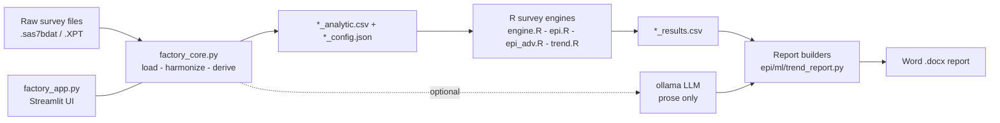

# KNHANES + NHANES Research Automation Platform

> Harmonize two national health surveys, run survey-weighted analyses across exposure x outcome combinations, and auto-generate epidemiology, trend, and machine-learning reports as Word documents.


The **Korea National Health and Nutrition Examination Survey (KNHANES)** and the U.S. **National Health and Nutrition Examination Survey (NHANES)** are harmonized into a single variable registry. Pick any exposure and any outcome, and the platform builds the survey-weighted analytic sample, computes associations, causal-inference estimates, temporal trends, and prediction models, then writes a publication-style report.

The guiding rule: **the language model writes prose, R computes every number.** No statistic is ever invented or recomputed by the model.

---

## Highlights

| Area | What it does |
|---|---|
| **Harmonization** | One registry maps KNHANES `HE_*` and NHANES `LBX*`/`BMX*` variables to shared clinical concepts (diabetes, hypertension, dyslipidemia, metabolic syndrome, hepatic steatosis, body composition). |
| **Survey statistics** | All estimates use R `survey` with strata, PSU clustering, and sampling weights. Continuous outcomes -> linear beta; binary outcomes -> logistic OR. Benjamini-Hochberg FDR across combinations. |
| **Causal inference** | Crude / minimally-adjusted / fully-adjusted OR, IPTW, G-computation, AIPW (doubly robust), Love plot, VIF, restricted cubic spline nonlinearity, and E-value for unmeasured confounding. |
| **Trends** | Yearly prevalence, age-sex standardization, linear projection, sex stratification, Joinpoint APC with bootstrap CI, and negative-binomial forecasting. |
| **Machine learning** | Six tuned classifiers, full metric panel, ROC/PR curves, threshold analysis, calibration, SHAP, and partial-dependence plots, with leakage guards. |
| **Reporting** | Every analysis is exported as a formatted Word (`.docx`) report; an optional local LLM (ollama) writes Methods/Results/Discussion prose from the computed numbers. |

---

## Architecture

Python orchestrates; R computes. The two communicate over **files**, not a runtime bridge, so the pipeline is robust on Windows and every intermediate becomes an audit artifact.



**Why file-based?** Python writes `*_analytic.csv` + `*_config.json`, calls `Rscript` via `subprocess`, and R writes `*_results.csv` back. There is no `rpy2` dependency to break, and each intermediate file is a reproducible record of exactly what was analyzed.

---

## Repository layout

| File | Role |
|---|---|
| `factory_app.py` | Streamlit web UI (5 tabs: interactive, trajectory, epidemiology, trend, ML) |
| `factory_core.py` | Loaders, harmonization, operational definitions, auto-covariate selection, engine calls, trajectory, LLM glue, HTML report |
| `engine.R` | Table 1 + associations (linear beta / logistic OR) |
| `epi_report.py` + `epi.R` + `epi_adv.R` | Epidemiology report: Tables 1-6, IPTW/AIPW/G-comp, Love, VIF, RCS, E-value |
| `trend_report.py` + `trend.R` | Trend report: standardization, projection, Joinpoint APC, NB forecast |
| `ml_report.py` | 6-model registry, tuning, ROC/PR, calibration, SHAP, PDP |
| `local_llm.py` | ollama client with deterministic fallback |
| `preflight.py` | Environment / dependency checks |
| `suppl/` | 7,584 generated evidence reports (Word) + association manifests |
| `rag/` | Plain-language retrieval-augmented search over the reports |

---

## Operational definitions (journal standard)

| Outcome | Definition |
|---|---|
| Diabetes | FPG >= 126 mg/dL, or HbA1c >= 6.5%, or medication, or physician diagnosis |
| Hypertension | SBP >= 140 or DBP >= 90 mmHg, or antihypertensive medication |
| Metabolic syndrome | Harmonized NCEP ATP III (3 of 5) |
| Dyslipidemia | TC >= 240 or HDL < 40 or TG >= 200 mg/dL |
| Hepatic steatosis | NAFLD-LFS > -0.640 (KNHANES, default) / CAP >= 248 dB/m (NHANES) |
| Smoking / alcohol | Never vs past/current |

Covariates are selected automatically and **exclude** the exposure, the outcome, the outcome's definitional components, and the anthropometry cluster to prevent overadjustment.

---

## Quick start

```bash
# Python dependencies
pip install streamlit pandas numpy pyreadstat python-docx requests matplotlib scikit-learn shap xgboost

# R (survey engine)
sudo apt-get install -y r-base r-cran-survey r-cran-jsonlite r-cran-rms r-cran-mass r-cran-sandwich

# Optional local LLM for prose (falls back to deterministic text if absent)
ollama pull llama3.2:latest && ollama serve

# Launch
streamlit run factory_app.py
```

On a port-restricted remote server, open an SSH tunnel and browse locally:

```bash
ssh -L 8501:localhost:8501 user@server
# then open http://localhost:8501
```

---

## Data

Raw microdata is **not** included in this repository and must never be committed.

- KNHANES: `data/KNHANES/hn{YY}_all.sas7bdat` and `hn{YY}_dxa.sas7bdat`
- NHANES: `data/NHANES/demo_{cycle}.sas7bdat`, `bmx_*`, `glu_*`, `ghb_*`, ... (or the original `.XPT`)

Set the data folder in the app sidebar. The loader searches recursively and normalizes column-name casing.

---

## Evidence reports and plain-language search (RAG)

The full corpus of **7,584 machine-generated, audited analysis reports** (Word) is included under [`suppl/`](suppl/), together with the two association manifests (`suppl/_manifest_association_{KNHANES,NHANES}.csv` — every pair with estimate, 95% CI, p, FDR q, N, and adjustment set). A small **retrieval-augmented search tool** in [`rag/`](rag/) lets anyone — not only a statistician — ask a plain-language question and get the exact answer with a link to the source report.

```
suppl/{KNHANES,NHANES}/association/<Outcome>/<Exposure>__<Outcome>_<SURVEY>.docx
                       trend/<Outcome>__trend_<SURVEY>.docx
                       ml/<Outcome>__prediction_<SURVEY>.docx
```

**Use it (no expertise required):**

```bash
pip install -r rag/requirements.txt
python rag/build_index.py          # one time; reads suppl/ and builds a local index
streamlit run rag/app.py           # open the browser tab and type a question
# or from the command line:
python rag/ask.py "Is uric acid associated with hypertension in NHANES?"
python rag/ask.py "odds ratio for BMI and diabetes" --survey KNHANES
```

By default the search uses TF-IDF and needs **no external service**. For semantic search and written answers, install [Ollama](https://ollama.com) (`ollama pull bge-m3 && ollama pull llama3.2`) and add `--backend ollama` when building the index.

**Guarantee.** The tool retrieves and quotes; **it never generates a number.** Answers are grounded only in the retrieved reports, with every figure copied verbatim and each claim cited to its source report, mirroring the platform's provenance rule. All results are cross-sectional and hypothesis-generating. See [`rag/README.md`](rag/README.md) for full details.

---

## Design principles

1. **The LLM writes prose only.** All statistics come from R survey. Numbers absent from a table never appear in a sentence.
2. **Missing is never zero.** Threshold-derived variables keep `NaN` when the source measurement is missing.
3. **No circular definitions.** Exposure-outcome pairs where the exposure is a definitional component of the outcome are skipped.
4. **Complex-survey subsets only.** Subgroups are formed with `subset(design, ...)`, never by slicing a data frame.

---

## Limitations

- Hepatic steatosis is measured differently across countries (KNHANES index vs NHANES CAP) -- an intentional, documented choice.
- Automated exposome screening adjusts for age and sex only; it is not a full mutually-adjusted model.
- A single weight is used; fasting-subsample-specific weights are not applied (a documented simplification).
- All results are cross-sectional and **hypothesis-generating**; they require external validation and do not support causal claims.

---

## Disclaimer

This platform is for research and educational use. It does not provide medical advice. Survey estimates depend on correct weight, strata, and cluster specification for the chosen cycles.
